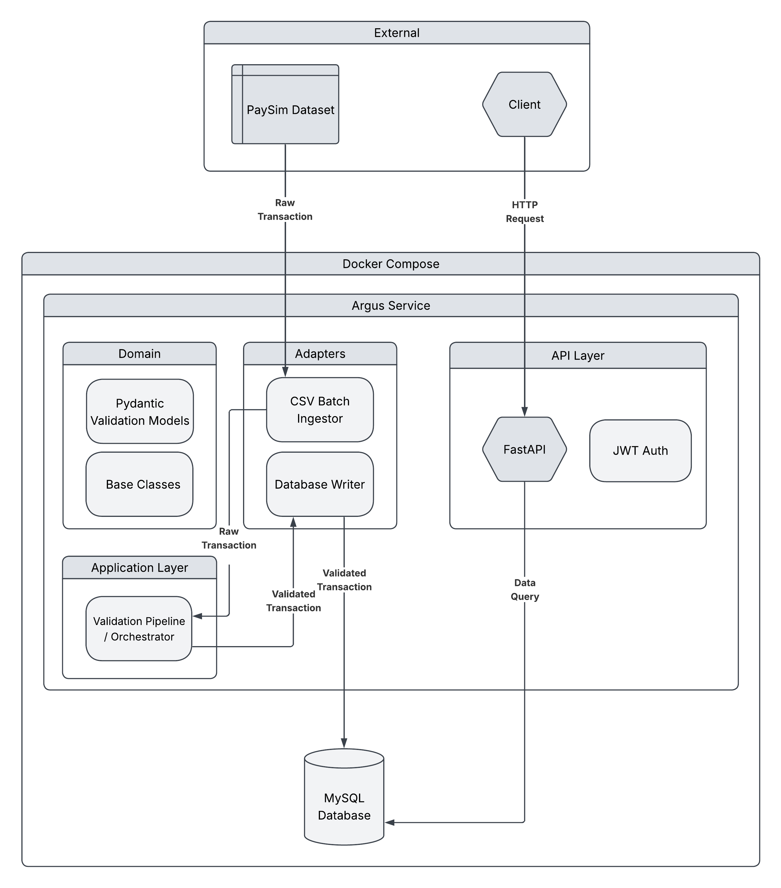

# Argus

<br>

**Argus is an end-to-end, high-performance financial transaction validation engine and REST API.<br>**
Built around strict data contracts for ensuring schema and type consistency.<br>
Argus sanitizes raw financial data, persists validated records, and exposes JWT-authenticated endpoints for exploring 
transactions and user analytics.

## Highlights

* **Strict data contracts** powered by Pydantic for sub-millisecond validation.
* **JWT authentication** for secure user registration, authentication, and token-protected API endpoints.
* **REST API endpoints** to query transaction history and fetch user summaries.
* **Extensible Architecture** via abstract base classes to decouple core business logic from data sources, making it simple to plug in new storage layers or input sources.
* **Automated CI/CD Pipeline** testing with `pytest` and `ruff` on every commit, with automated Docker builds published to GitHub container registry.


## Quick setup
1. Create an <code>.env</code> file at the root and add your <code>MYSQL_ROOT_PASSWORD</code> and <br> 
<code>MYSQL_DATABASE</code> variables.
2. ```markdown
   docker compose up --build
   ```
By default the docker compose uses the paysim sample dataset with 100 rows I added to this repo.
For the full dataset I used during this project, please visit: https://www.kaggle.com/datasets/ealaxi/paysim1/data and
then replace the sample csv file. Make sure to change references to the file in the <code>01-init.sql</code> file in
init-scripts and the reference to the data set in main.py.

## Architecture
<div align="left">
  
</div>

## Motivation

Argus is a technical sandbox which allows me to experiment with building high-throughput data pipelines in my free time.
The main motivation is for me to improve my software engineering skills and play around with various tools and designs.

While my previous projects focussed on implementing certain logic or building proof-of-concept tools,<br>
Argus focusses on good engineering practices, like defensive programming (e.g. Pydantic) and architectural design<br>
(e.g. decoupling logic from data source).

## Author
I'm Lucas, a data engineer based in The Netherlands. I have a background in statistics and programming and 
am interested in improving my software engineering skillset inside and outside of my job. 
